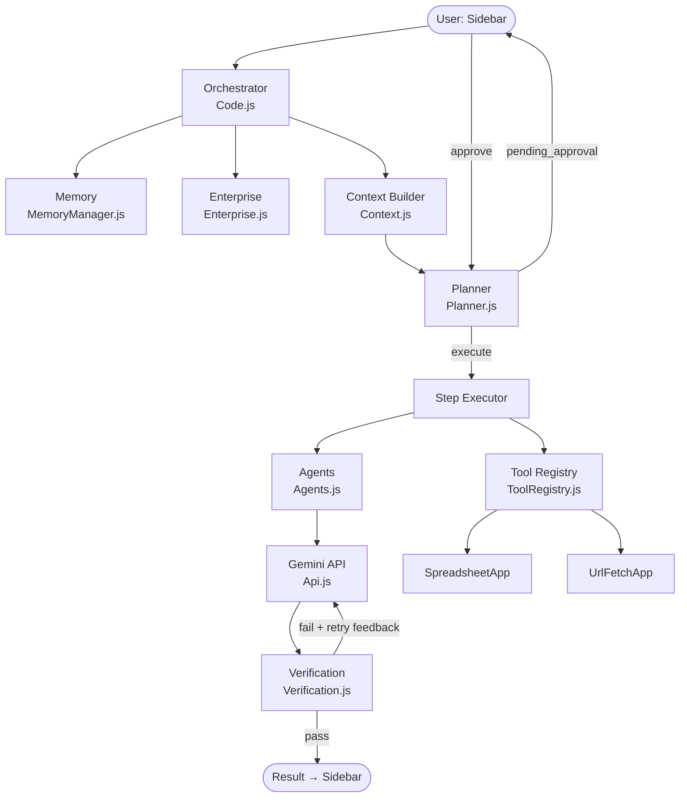
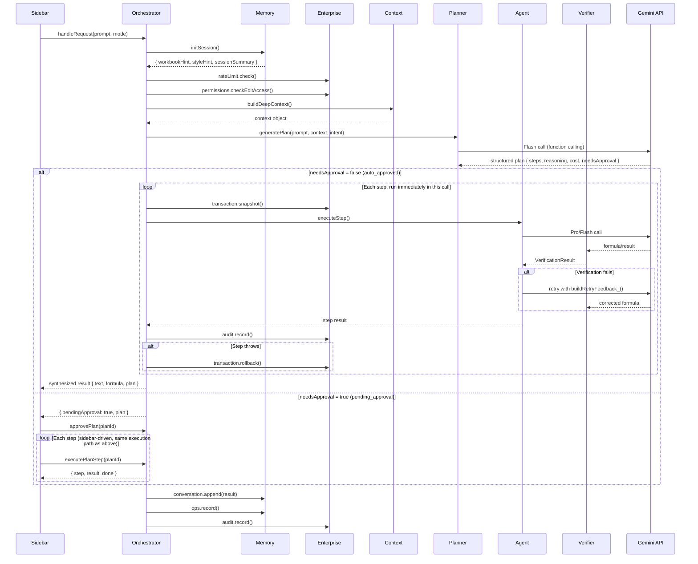
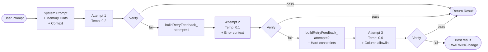
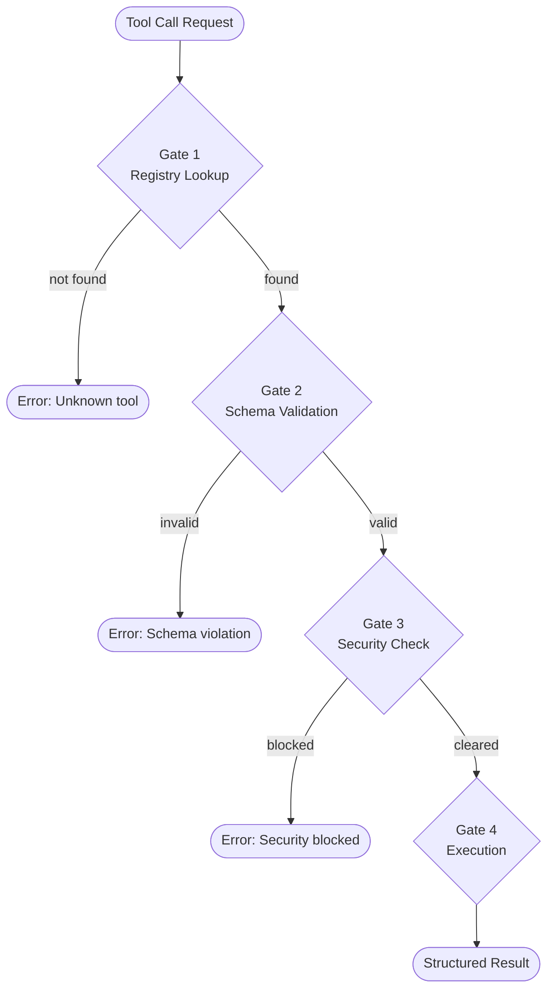
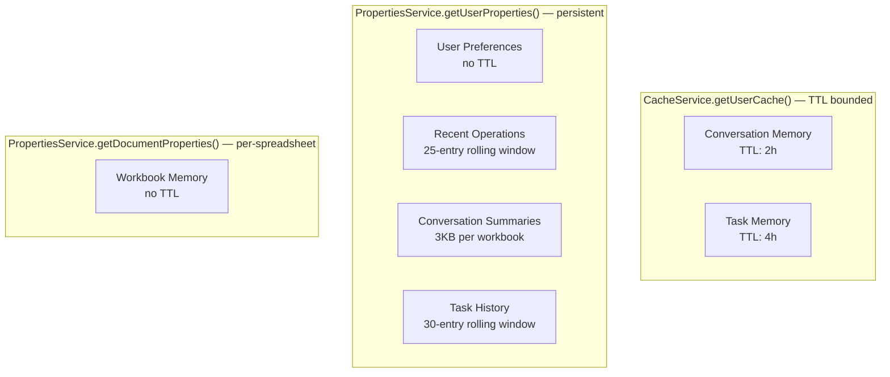
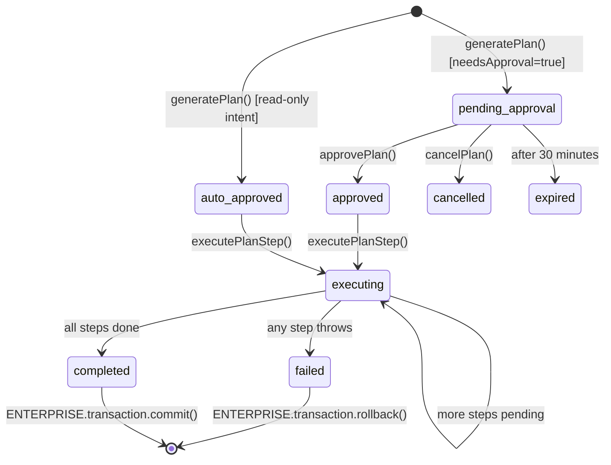
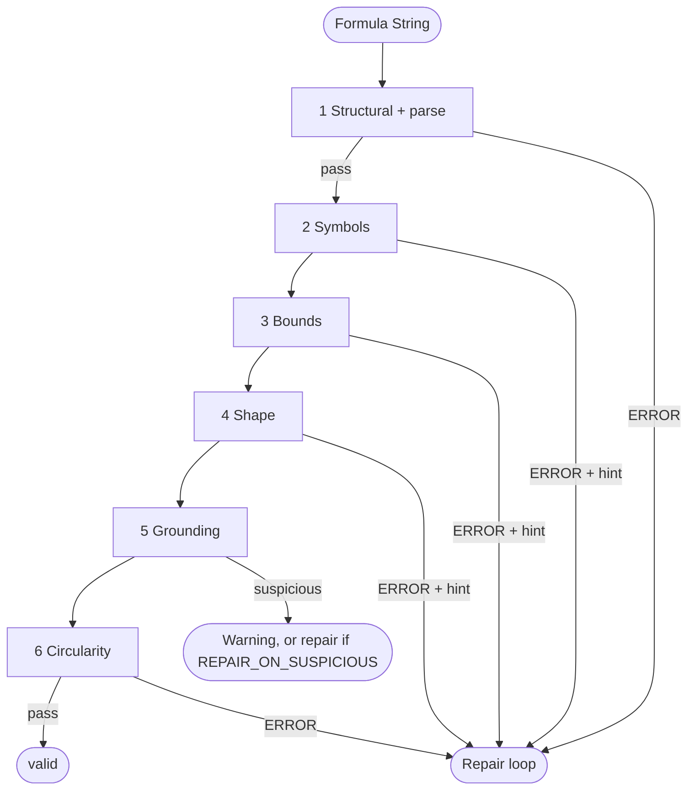
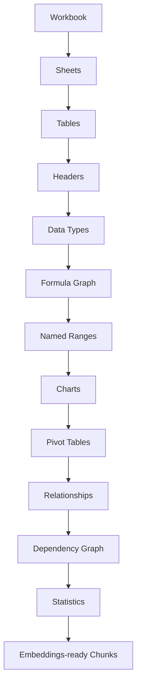

# GroundCheck and SheetFault

**Code, benchmark and data for the paper "Ground Check: A Multi-Layer Workbook-Grounded Verification Framework for Reliable LLM-Based Spreadsheet Agents"** — Ansh Jerath and Jagadeesan S (School of Computer Science and Engineering and Information Systems, Vellore Institute of Technology).

A language model that writes a spreadsheet formula can fail in two ways: **loudly**, leaving `#REF!` or `#NAME?` in the cell, or **silently**, leaving a plausible but wrong number. This repository holds a verifier that runs *before* the formula is written, a benchmark that measures it, and every script and result file behind the paper.

- **GroundCheck** — a deterministic verifier that parses a candidate formula and checks it in six layers (structural, symbols, bounds, shape, grounding, circularity) against the open workbook. No second model call. It lives in [`Verification.js`](Verification.js) with the parser in [`FormulaParser.js`](FormulaParser.js); see [Verification pipeline](#verification-pipeline).
- **SheetFault** — a seeded benchmark of 24,248 formulas (13,356 faulty, 10,892 clean) built from 72 generated workbooks and 20 fault operators. Every label comes from [HyperFormula](https://github.com/handsontable/hyperformula), an **independent** spreadsheet engine, never from the verifier under test. Generators are in [`eval/lib/`](eval/lib).
- **The system under study** — the verifier is not a stand-alone prototype. It ships inside a working Google Sheets add-on (about 9,400 lines of Apps Script, 163 tests), and the experiments run that add-on's own source files unmodified. The rest of this README documents that add-on.

### Where things are

| You want to | Go to |
|---|---|
| Reproduce the numbers in the paper | [Reproducing the evaluation](#reproducing-the-evaluation) |
| Read the raw experiment output | [`eval/results/`](eval/results) |
| See the verifier itself | [`Verification.js`](Verification.js), and [Verification pipeline](#verification-pipeline) |
| See the benchmark generators | [`eval/lib/faults.js`](eval/lib/faults.js), [`eval/lib/workbookGen.js`](eval/lib/workbookGen.js), [`eval/lib/oracle.js`](eval/lib/oracle.js) |
| Try the verifier on your own formula | `cd eval && node worked_example.js "=SUM(Z1:Z9)"` |
| Install and use the add-on | [Running it yourself](#running-it-yourself) |
| Read the paper source | [`paper/`](paper) |

The Sheetpedia workbooks used for the real-formula experiments are **not** redistributed here — they are released separately under CC BY-SA 4.0, and [`eval/realworld/`](eval/realworld) holds the scripts that fetch and sample them. See [Data and licensing](#data-and-licensing).

This file is the **only** documentation in this repo — everything that used to live in separate design/audit/planning documents has been folded in below, so there's one place to read.

---

## Table of contents

- [What it can actually do](#what-it-can-actually-do)
- [How it's put together](#how-its-put-together)
- [System architecture](#system-architecture)
- [Request lifecycle](#request-lifecycle)
- [Agent architecture](#agent-architecture)
- [Tool architecture](#tool-architecture)
- [Memory architecture](#memory-architecture)
- [Planning system](#planning-system)
- [Verification pipeline](#verification-pipeline)
- [Enterprise capabilities](#enterprise-capabilities)
- [Security model](#security-model)
- [Workbook analysis engine](#workbook-analysis-engine)
- [Context retrieval](#context-retrieval)
- [Observability](#observability)
- [Execution control](#execution-control-progress-cancellation-resume-undoredo)
- [Sidebar interface](#sidebar-interface)
- [Prompt engineering](#prompt-engineering)
- [Scalability & future work](#scalability--future-work)
- [Project layout](#project-layout)
- [Running it yourself](#running-it-yourself)
- [Running the tests](#running-the-tests)
- [Reproducing the evaluation](#reproducing-the-evaluation)
- [Data and licensing](#data-and-licensing)
- [Citation](#citation)
- [Storage key reference](#storage-key-reference)
- [A few things worth knowing](#a-few-things-worth-knowing)

---

## What it can actually do

Open the sidebar and just type what you want, in plain English:

- **"Sum revenue by region"** → writes a formula into the active cell
- **"Why is this formula giving #REF!?"** → explains the bug and fixes it
- **"What does this formula do?"** → plain-English explanation of a complex formula
- **"Get 10 fake users from an API"** → fetches JSON from a public API and drops it into the sheet as columns
- **"Push this row to my webhook"** → reads a row, builds a JSON payload, sends it to a webhook URL

Under the hood, every request goes through the same disciplined pipeline, and you get to see all of it in the sidebar:

- **Plan before it runs** — the assistant shows you what it's about to do (which tools, what it'll cost) before touching your sheet. Simple read-only requests run instantly; anything that writes data or costs real money waits for your approval.
- **Verification, not blind trust** — every formula is checked for invalid columns, bad sheet references, circular references, syntax errors, made-up functions, and out-of-bounds ranges before it's shown to you. If it fails, the assistant retries with the specific error fed back to it.
- **Memory** — it remembers your recent conversation, the shape of your workbook, formulas you've accepted before, and your formatting preferences (e.g. "always use XLOOKUP instead of VLOOKUP"), and quietly uses all of that to make better suggestions next time.
- **Undo / Redo** — every write the assistant makes can be undone, and undone actions can be redone.
- **Full activity trace** — a dedicated tab shows exactly what happened for any request: which tools ran, how long each step took, what it cost, how many retries happened, and the actual prompts/context sent to the AI model.
- **Current Context view** — a tab that shows exactly what part of your workbook the assistant is currently "looking at" and why (which sheets, tables, and formulas it picked as relevant, out of everything in the workbook).

---

## How it's put together

```
You type a request in the sidebar
        ↓
The assistant reads your spreadsheet (active sheet, headers, sample data,
nearby formulas, and — if useful — relevant bits of OTHER sheets too)
        ↓
It classifies what you're asking for (generate / debug / explain / fetch / push)
        ↓
It builds a step-by-step PLAN (e.g. "1. look up headers, 2. ask the AI
model for a formula, 3. insert it") with an estimated cost
        ↓
Cheap, read-only plans run immediately.
Plans that write data or cost money wait for you to click Approve.
        ↓
Each step runs through a small set of specialist agents (formula writer,
debugger, explainer, data fetcher, data pusher), and every formula is
verified before you see it.
        ↓
Result shows up in the chat, with an Insert/Undo option, and everything
that happened is logged in the Activity tab.
```

The rest of this file is the full technical reference — how each piece actually works, in the order a request flows through them.

---

## System architecture

The system is organized as a layered pipeline. Every user request traverses the full stack top-to-bottom. No layer skips another.



### File responsibilities

| File | Responsibility |
|---|---|
| `Code.js` | Orchestrator + all sidebar-callable entry points |
| `Config.js` | All constants, pricing, error types, logging |
| `MemoryManager.js` | Five-layer memory system |
| `Planner.js` | Task planning, approval workflow, step execution |
| `Enterprise.js` | Undo/redo stack, audit, cost tracking, dry run, transactions |
| `Agents.js` | Specialist agents with a uniform plan/execute/verify/retry/explain interface |
| `Router.js` | Intent classification via Gemini function calling |
| `Context.js` | Spreadsheet context builder (active sheet snapshot) |
| `FormulaParser.js` | Pure tokenizer + parser: formula text → typed AST (calls, refs, ranges, literals) |
| `Verification.js` | Six-layer workbook-grounded formula verification, retry feedback builder, SSRF URL validator |
| `Tools.js` | JSON flattening for API responses |
| `ToolRegistry.js` | Four-gate tool calling engine: schema validator, SQL mini-parser, pivot/dashboard builders, the 11-tool registry, dispatch |
| `Api.js` | Gemini API client with retry |
| `SpreadsheetEngine.js` | Pure deterministic workbook analysis: tables, data types, formula graph, dependency graph, statistics, embedding chunks |
| `ContextRetriever.js` | Relevance-ranked context selection under a token budget |
| `Observability.js` | Execution tracing: timeline, agent trace, prompts, tool calls, cost, retries, verification results |
| `Sidebar.html` | Full UI: Chat, Plan, Context, Activity, History, Settings |

---

## Request lifecycle

> **No direct execution without planning.** Every request builds an execution plan first — there is no "Direct Mode" that skips straight to an agent. Read-only/cheap intents come back `auto_approved` (the Planner LLM marks them `needsApproval:false`), and `handleRequest()` executes that plan's steps immediately in the same call, so the common case still feels instant. Destructive/costly intents come back `pending_approval` and stop — nothing runs until the sidebar calls `approvePlan()` + `executePlanStep()` (or Plan Mode's `generatePlanForPrompt()`, for previewing a plan before it runs even when it would have auto-approved).



---

## Agent architecture

### Agent roster

| Agent | File | Model | Primary tool |
|---|---|---|---|
| Formula Agent | `Agents.js` | Pro | `insert_formula` |
| Debug Agent | `Agents.js` | Pro | `read_formula` |
| Explanation Agent | `Agents.js` | Flash | (read-only) |
| Fetch Agent | `Agents.js` | Flash | `fetch_api` |
| Push Agent | `Agents.js` | Flash | webhook POST |
| Planner Agent | `Planner.js` | Flash | (meta-agent) |
| Router Agent | `Router.js` | Flash | intent classification |

### Uniform agent interface

Every specialist agent (`FormulaAgent`, `DebugAgent`, `ExplanationAgent`, `DataAgent`, `PushAgent`) exposes the same five methods:

```javascript
agent.plan(session)     // build the system prompt / setup for this request
agent.execute(session)  // take one action (an LLM call, a fetch, a write)
agent.verify(session)   // check the result (verifyFormula_, verifyDataShape_, ...)
agent.retry(session)    // re-execute with structured error feedback after a failed verify()
agent.explain(session)  // produce the human-readable text — display only, never branched on
```

All five communicate through one structured JSON **session** object that accumulates state as it's threaded through each call (`session.candidate`, `session.verification`, `session.explanation`, ...). No method parses another method's natural-language output to decide what to do next.

`runAgentLoop_(agent, initialSession)` drives any conforming agent through Reason → Act → Observe → (retry) → Explain:

```javascript
function runAgentLoop_(agent, initialSession) {
  var session = agent.plan(initialSession);
  session.attempt = 0;
  while (true) {
    session = session.attempt === 0 ? agent.execute(session) : agent.retry(session);
    session = agent.verify(session);
    if (session.verification.valid || session.attempt >= session.maxRetries) {
      return agent.explain(session);
    }
    session.attempt++;
  }
}
```

`FormulaAgent` is the only agent with a real self-correction loop (`maxRetries: 2`). `DebugAgent`, `ExplanationAgent`, `DataAgent`, and `PushAgent` set `maxRetries: 0` — the loop runs their `execute()` once and stops. `DataAgent` and `PushAgent`'s pipelines are inherently sequential (router call → fetch → flatten → write) rather than a single generate/verify/retry candidate, so their real logic lives in `execute()`/`explain()` as one action; `verify()` still re-checks the result standalone for interface uniformity.

Legacy call shapes (`agentGenerateFormula_(prompt, context, chatHistory)`, `agentDebugFormula_(brokenFormula, context)`, etc.) are preserved unchanged for `Code.js`/`Planner.js` — internally they just call `runAgentLoop_()` and reshape the final session into the `{ text, formula, ... }` object those callers already expect.

### ReAct loop pattern

All write-capable agents use the Reason → Act → Observe loop:



### System prompt structure

Every agent's system prompt is assembled in this order:

```
1. ROLE DECLARATION
   "You are a Google Sheets formula expert..."

2. WORKBOOK CONSTRAINTS (from MEMORY.workbook.getContextHint())
   "WORKBOOK CONSTRAINTS:
     Sheet2!A:A: Raw data — never write to this column"

3. USER PREFERENCES (from MEMORY.prefs.getStyleHint())
   "USER PREFERENCES:
     This user prefers XLOOKUP over VLOOKUP."

4. SESSION CONTEXT (from MEMORY.conversation.getSummary())
   "Current session context: 3 requests so far."

5. SPREADSHEET CONTEXT (from Context.js)
   "Active sheet: Sales | Active cell: D5 | Headers: ..."

6. OUTPUT CONSTRAINTS
   "Output: formula only, no explanation, no markdown."
```

---

## Tool architecture

### The four-gate execution pipeline



`ToolRegistry.js` centralizes gates 1–2 in `executeTool_(name, args)`. Gate 3's specific security action (SSRF validation, formula validation, or an undo checkpoint) and gate 4's execution are combined inside each tool's own `execute()` function, because the exact security action — and, for undo, the exact write range to snapshot — is tool-specific and often only known once args are parsed.

### Tool catalogue

| Tool | Type | Destructive | Security gate |
|---|---|---|---|
| `read_cells` | SpreadsheetApp | No | None |
| `write_cells` | SpreadsheetApp | Yes | Undo checkpoint |
| `read_formula` | SpreadsheetApp | No | None |
| `insert_formula` | SpreadsheetApp | Yes | `verifyFormula_()` + undo |
| `create_chart` | SpreadsheetApp | Yes | Undo checkpoint |
| `fetch_api` | UrlFetchApp | No | SSRF + header allowlist |
| `run_sql` | In-memory JS | No (by default) | SELECT-only parser |
| `search_headers` | SpreadsheetApp | No | None |
| `inspect_workbook` | SpreadsheetApp | No | None |
| `generate_pivot` | SpreadsheetApp | Yes | Undo checkpoint |
| `generate_dashboard` | SpreadsheetApp | Yes | `verifyFormula_()` each metric |

Every tool returns exactly one of:
```javascript
{ ok: true,  result: { ...typed fields... } }
{ ok: false, error: "human-readable failure reason" }
```
Tools never throw. Errors are values.

### Structured tool calling

No agent calls `SpreadsheetApp` or `UrlFetchApp` directly — every operation is expressed as one structured call and dispatched through `executeStructuredToolCall_()`:

```javascript
{
  tool_name: 'insert_formula',       // must exist in TOOL_REGISTRY
  arguments: { cell: 'B2', formula: '=SUM(B2:B10)' },
  expected_output: { verified: true }, // optional: deep-equal check per key against the result
  verification: function(result) { ... } // optional: custom predicate for pass/fail beyond exact-match
}
```

This wraps `executeTool_()`'s four gates with an explicit verification step and always returns the same record shape, regardless of which tool ran:

```javascript
{
  tool_name, arguments, expected_output,
  ok,               // did the underlying tool call succeed?
  error,            // set when ok is false
  result,           // the tool's typed result, or null
  verification: {
    passed,               // ok && expectedOutputCheck.passed && customCheck.passed
    expectedOutputCheck,  // { checked, passed, mismatches[] }
    customCheck           // { ran, passed, details }
  }
}
```

`expected_output` and `verification` are independent: a tool call can succeed (`ok: true`, the write/fetch actually happened) while still failing verification (e.g. a webhook responded with `500`). Callers decide what to do with a verification failure — usually throw, but the operation itself isn't silently rolled back, since it already happened.

---

## Memory architecture

### Storage tier assignment



### Conversation memory lifecycle

```
First request of session
    → CacheService.get(MEM_CONV) → null
    → MEMORY.conversation.init(spreadsheetId)
        → load prior summary from UserProperties (if exists)
        → create session object { sessionId, turns: [], priorContext }
        → CacheService.put(MEM_CONV, session, 7200s)

Each request
    → MEMORY.conversation.append({ role, content, tokenCount })
    → if turns > 15 OR tokens > 18000 → _compressInPlace_()
        → keep last 8 turns verbatim
        → collapse older turns into one "compressed" turn
    → CacheService.put(MEM_CONV, compressed, 7200s)

Session end / clearConversationMemory()
    → _archiveSummary_() → PropertiesService.setProperty(MEM_SUM_<id>, summary)
    → CacheService.remove(MEM_CONV)
    → next session loads summary as priorContext
```

### Workbook memory lifecycle

```
First use of this spreadsheet
    → DocumentProperties.get(MEM_WORKBOOK) → null
    → MEMORY.workbook.init(id, title, schemaHash)
    → DocumentProperties.set(MEM_WORKBOOK, { ...initial state })

Formula accepted by user
    → MEMORY.workbook.learn(description, formula)
    → learnedPatterns.push() → sorted by count → capped at 50

Context injection
    → MEMORY.workbook.getContextHint()
    → top 5 patterns + all annotations → injected into every system prompt
```

### Task history

Distinct from the ephemeral **Task Memory** above (CacheService, 4h TTL, tracks the *currently executing* plan) — Task History is a **permanent** record of what was attempted, persisted in `UserProperties` as a 30-entry rolling window. This is the mechanism behind "memory automatically influences future planning": `Planner.js`'s `generatePlan()` calls `MEMORY.buildContextString(intent)` on every call, which folds in `taskHistory.getContextHint(intent)` — a plain-language summary of past success rate and the most common successful step sequence for that exact intent — with no extra step required from the caller.

```
Plan completes (any status) → Planner.js's executePlanStep()
    → recordTaskHistory_(plan, 'completed' | 'failed')
    → MEMORY.taskHistory.record({ taskId, intent, prompt, status, stepCount, stepTools })

Next generatePlan() call for the same intent
    → MEMORY.buildContextString(intent)
    → taskHistory.getContextHint(intent) →
        "TASK HISTORY for 'generate_formula': 4/5 past attempts succeeded.
         Common successful step pattern: search_headers -> llm:generate_formula -> insert_formula"
    → injected into the Planner LLM's system prompt (a soft signal — never a hard constraint)
```

---

## Planning system

> **Two callers, same internal `generatePlan()`.** `handleRequest()` (`Code.js`) calls `generatePlan(prompt, contextStr, intent)` directly on every request — no direct execution without planning. Separately, the sidebar's Plan Mode toggle calls `generatePlanForPrompt(prompt)`, a thin wrapper that builds context and classifies intent before calling the same internal `generatePlan()` — useful when a user wants to preview a plan before it runs even for an intent that would have auto-approved.

### Plan state machine



### Step dependency resolution

Steps execute in dependency order. A step only runs when all its `dependencies[]` are `completed`.

```
Plan: { steps: [
  { stepId: "1", tool: "search_headers", dependencies: [] },
  { stepId: "2", tool: "llm:generate_formula", dependencies: ["1"] },
  { stepId: "3", tool: "insert_formula", dependencies: ["2"] }
]}

Execution sequence:
  Step 1 → runs (no deps)
  Step 2 → runs (step 1 completed)
  Step 3 → runs (step 2 completed)
```

### Cost estimation schema

| Step type | Estimated cost |
|---|---|
| `llm:*` with Pro model | $0.010 |
| `llm:*` with Flash model | $0.001 |
| Any tool (SpreadsheetApp) | $0.000 |
| `fetch_api` | $0.000 |

---

## Verification pipeline

### Six workbook-grounded layers

Every formula the model produces is parsed (`FormulaParser.js` turns it into a typed AST) and checked against the actual workbook before it is shown or written. The checks are deterministic: no model call, no network.



| Layer | Checks | Hard error vs. warning |
|---|---|---|
| 1. Structural | Starts with `=`, balanced quotes and parentheses (parentheses inside string literals are ignored), injection patterns (`DDE(`, `javascript:`), and a full parse | Hard error; skips the remaining layers |
| 2. Symbols | Sheets that do not exist (case-insensitive, as in Sheets); bare identifiers that are neither functions nor named ranges (a column header used as a reference, with a hint giving the real column letters); near-miss function names (`SUMIFF` → "Did you mean SUMIF?"); out-of-range `QUERY` column letters; a `#REF!` or `#NAME?` literal left in the formula (a deleted reference or unrecognised name); `INDIRECT("Sheet!A1")` whose text names a sheet that does not exist (names built from cell values are not checkable) | Errors; a function name that is not close to any real function is only a warning (it may be a custom Apps Script function) |
| 3. Bounds | References checked against the sheet they point at: a range wholly outside the used columns | Error. A range that merely extends past the last data row is treated as headroom (a note, not a finding); a range that starts below all data is a warning; `COUNTA`/`COUNTBLANK`/`ISBLANK` may point at empty regions |
| 4. Shape | Argument counts for ~90 functions; `VLOOKUP`/`HLOOKUP` index beyond the lookup range; literal `INDEX` positions beyond a range; mismatched range sizes in `SUMIFS`/`COUNTIFS`/`SUMIF`/`SUMPRODUCT`… | Errors |
| 5. Grounding | A numeric aggregate (`SUM`, `AVERAGE`, …) over a column of text; a criterion or lookup key that never occurs in the column it searches (`COUNTIF(A:A,"Northeast")` when the column holds East/West/North/South) | "Suspicious": reported as warnings with the real values as a hint. Set `CONFIG.VERIFICATION.REPAIR_ON_SUSPICIOUS = true` to send them through the repair loop |
| 6. Circularity | The target cell appears inside a referenced range (`=SUM(F2:F81)` typed into F81, `=SUM(F:F)` into column F), or a dependency chain through other formulas leads back to it; `ROW`/`ROWS`/`COLUMN`/`COLUMNS` read only a reference's geometry and never create a cycle | Error |

Each layer can be switched off in `CONFIG.VERIFICATION.LAYERS` (used by the ablation study in `eval/`; leave them on in production).

What it deliberately **cannot** do: decide whether a formula answers the user's question. `=SUM(Quantity)` summing the wrong numeric column is valid and wrong; only the user (or a test oracle) can tell.

Tools that write to an explicit cell (`insert_formula`, `generate_dashboard`) verify against that destination via `targetContext_()`, not the active cell, so circularity is judged where the formula will actually live.

### Retry escalation

| Attempt | Prompt modification | Temperature | Goal |
|---|---|---|---|
| 1 | Original | 0.2 | Normal generation |
| 2 | + structured retry feedback | 0.1 | See exact errors |
| 3 | + hard column/function constraints | 0.0 | Eliminate hallucination surface |
| Fallback | — | — | Return best result + ⚠️ badge |

---

## Enterprise capabilities

### Undo stack

```
PropertiesService.getUserProperties["ENT_UNDO"] = [
  {
    id: "undo_1721236000000",
    description: "Insert formula =SUMIF(B:B,...) in D5",
    sheetName: "Sales",
    range: "D5",
    values: [[""]],
    formulas: [[""]],
    timestamp: "2026-07-17T02:35:00Z"
  },
  ...up to 10 entries...
]
```

Restore order is newest first. `pop()` takes the top entry and restores cells using `setFormula()` (if a formula was present) or `setValue()`. `ENTERPRISE.redo` mirrors the same stack, ping-ponging with undo: undoing a change pushes what it overwrote onto redo, and any fresh write clears the redo stack entirely (standard undo/redo semantics).

### Transaction lifecycle

```
ENTERPRISE.transaction.snapshot(step)   ← called before each write
ENTERPRISE.transaction.commit()         ← called on plan success
ENTERPRISE.transaction.rollback()       ← called on plan failure
    → iterate snapshots in reverse (undo last write first)
    → restore each cell: setFormula() or setValue()
```

### Cost tracking

Each Gemini call records:
```javascript
{
  timestamp, model, agent,
  inputTokens, outputTokens,
  costUsd: (inputTokens/1e6 * pricing.input) + (outputTokens/1e6 * pricing.output)
}
```
Displayed in the sidebar as a running session cost, and in Settings as total lifetime cost.

---

## Security model

### Threat surface and mitigations

| Threat | Vector | Mitigation |
|---|---|---|
| SSRF | `fetch_api` URL | The URL is parsed and its host classified (not pattern-matched): IPv4 in any `inet_aton` form (decimal, hex, octal, `127.1`), IPv6 incl. IPv4-mapped / NAT64 / 6to4, loopback, RFC 1918, CGNAT, link-local and cloud-metadata ranges, internal-only and wildcard-DNS names, embedded credentials, backslashes. Redirects are never auto-followed: every hop is re-validated |
| Formula injection | `insert_formula` | Structural validation gates; blocked patterns: `DDE()`, `javascript:` URI |
| Prompt injection | User prompt in context | Context is structured JSON, not interpolated into user-facing prompts |
| Data exfiltration via fetch | LLM-generated URL | SSRF validation + URL logging in audit trail |
| Cross-sheet data leak | Formula cross-refs | Sheet existence validated in hallucination check |
| Session hijacking | `Cookie` header in fetch | Header blocklist in `fetch_api` |
| Host header injection | `Host` in fetch | Header blocklist in `fetch_api` |
| Rate abuse | Rapid API calls | 15 calls/minute per user, enforced before any LLM call |
| Unauthorized writes | View-only access | Edit-access check before destructive ops |
| Dry run bypass | | Dry run flag checked at the dispatch layer |

> [!NOTE]
> A static check cannot see DNS rebinding (a public-looking name whose DNS record points at a private address). `UrlFetchApp` requests leave from Google's network rather than the user's, which limits but does not remove that risk.

> [!CAUTION]
> Spreadsheet content (headers, sample values, formulas) is sent to the Gemini API as part of the context. Be aware of this for sensitive financial or PII data — consider redacting sensitive values before sending context.

---

## Workbook analysis engine

`SpreadsheetEngine.js` — pure, deterministic, offline analysis of the active workbook. **No Gemini calls, no network calls of any kind.**



Each layer is built from the one before it, and `SpreadsheetEngine.analyze()` runs the whole pipeline in this exact order, returning one assembled model. Almost every layer is a pure function over plain arrays/objects with zero `SpreadsheetApp` calls — a small number of thin wrapper functions read the spreadsheet once and hand plain data to the pure functions, which is what makes almost the entire engine unit-testable with plain JS fixtures.

- **Tables** are detected heuristically: contiguous non-empty cells separated from other tables by at least one fully-blank row or column.
- **Data types**: `empty | text | number | currency | percentage | boolean | date | mixed`.
- **Formula graph**: a best-effort static reference parser. Range references (`A1:B10`, `A:A`) are single graph nodes — expanding a range into one node per cell would make the graph intractable for no analytical benefit.
- **Dependency graph**: adds cycle detection (DFS, white/gray/black coloring), longest-chain depth per node, and root/leaf classification on top of the raw formula graph.
- **Embeddings-ready chunks**: deterministic text chunking only — no embedding model is called. One chunk per table (headers + types + stats), plus chunks for named ranges, cross-sheet relationships, and dependency graph highlights.

---

## Context retrieval

`ContextRetriever.js` chooses which parts of the workbook are worth spending prompt tokens on, instead of always sending the whole active sheet. It scores every chunk from the workbook analysis engine against seven signals, sorts by score, then greedily fills a token budget with the highest-scoring chunks — a knapsack, not a truncation.

### Ranking signals

| Signal | What it measures | Weight |
|---|---|---|
| Active sheet | Chunk belongs to the sheet the user is looking at | 3 |
| Referenced formulas | Chunk's cells are exactly one hop from the active cell in the formula graph | 5 |
| Semantic similarity | Lexical (Jaccard) overlap between the prompt and the chunk text | 4 |
| Shared headers | Chunk's column headers overlap the active table's headers | 2 |
| Neighboring tables | Chunk's table sits next to the active table on the same sheet | 1.5 |
| Dependency graph | Chunk's cells are graph-close to the active cell (either direction), decaying with hop distance | 3 |
| Previous conversation | Chunk's terms overlap recent conversation turns | 1 |

> [!NOTE]
> "Semantic similarity" here is lexical token overlap, not a real embedding model — no Gemini or network call happens in this file, matching the workbook engine's "pure deterministic analysis only" constraint. It occupies the same signal slot a real embedding-similarity score could later replace without changing the scoring or selection logic around it.

`Code.js`'s `handleRequest()` calls `ContextRetriever.retrieve(prompt, {})` and folds the ranked selection into the prompt context (non-fatally — a failure falls back to the flat active-sheet context alone). `getCurrentContext()` is the sidebar entry point behind the **Context** tab, showing exactly which chunks are currently winning the token budget and why.

---

## Observability

`Observability.js` captures everything that happens during one request into a single structured **trace**, rendered in the sidebar's Activity tab: Execution Timeline, Agent Trace (with Latency), Prompt Viewer, Context Viewer, Tool Calls, Cost, Retries, and Verification Results.

A single `google.script.run` call runs as one isolated GAS execution — there is no cross-request in-memory state in GAS. A module-level trace variable accumulates state for the duration of exactly one execution: starting the trace (at the top of `handleRequest()`) creates it; ending it (at the end, in every code path including catch blocks) persists it and clears the variable. Every trace helper is a no-op if no trace is active, so instrumentation call sites never need to check "is tracing on" first.

| Panel | Hook location |
|---|---|
| Execution Timeline | `Code.js`'s `handleRequest()` — request received, intent classified, plan generated/executed/pending |
| Agent Trace + Latency | `Api.js`'s `callGemini_()` — timed around every LLM call |
| Prompt Viewer | `Api.js`'s `callGemini_()` — captured (truncated to 4000 chars) before every LLM call |
| Context Viewer | `Code.js`'s `handleRequest()` — the spreadsheet context string built for this request |
| Tool Calls | `ToolRegistry.js`'s `executeStructuredToolCall_()` — every structured tool call record |
| Cost | `Api.js`'s `callGemini_()` — same pricing math as cost tracking |
| Retries | Incremented automatically whenever a verification comes back invalid |
| Verification Results | Every tool call + every formula check |

Plan Mode's step-by-step execution (the sidebar calls `executePlanStep()` once per step, each its own isolated GAS execution) never goes through `handleRequest()`, so it starts (and ends) its own trace around the step it runs — unless a trace is already running (i.e. it's being driven from inside an `auto_approved` plan's single-call execution), in which case the step's events fold into that outer trace instead of starting a nested one that would orphan it.

The full current/latest trace lives in `CacheService` (up to 100KB, 1-hour TTL). A lightweight summary (timing, cost, retries, status — no prompt text) of the last 20 traces is appended to a rolling history, so the Request History view doesn't threaten storage budgets.

---

## Execution control: progress, cancellation, resume, undo/redo

### What's NOT achievable on Google Apps Script (and why)

Some capabilities can't be built as literally as you might expect elsewhere, because the platform doesn't support the primitives they need:

| Requested | Why not | Closest GAS-feasible approximation |
|---|---|---|
| Streaming responses | A `google.script.run` call is one synchronous request/response — there is no SSE/WebSocket channel to push partial tokens to the browser as Gemini generates them | Progressive **per-step** delivery: `executePlanStep()` already returns one step's result at a time, and the sidebar's plan-execution loop updates the UI after each call |
| True mid-step cancellation | A running GAS function cannot be preempted — no mechanism for a second call to interrupt a function already executing | Cancellation **between steps** (see below) |
| Background execution | GAS has no arbitrary background job model — only time-driven triggers and a 6-minute synchronous execution limit | Not attempted — this needs a different runtime entirely (see [Scalability & future work](#scalability--future-work)) |

### Cancellation (between steps)

```
cancelPlanExecution(planId)                    // sidebar-callable
    → sets a per-plan cancellation flag

Next executePlanStep(planId) call
    → sees the flag → clears it, sets plan.status = 'cancelled'
    → records the cancellation in the audit log + task history
    → returns { done: true, cancelled: true, plan } — no further steps run
```

The step already in flight when cancellation is requested always finishes — there's no way to stop it mid-flight.

### Progress, resume & checkpoint recovery

`getPlanProgress(planId)` reads the persisted plan and reports `{ totalSteps, completedSteps, percentComplete, nextStep, failedStep }`. Since plans are persisted after every step, this reflects true state even across sidebar reloads. Resuming a plan (`resumePlanExecution(planId)`) validates that it's actually resumable (not completed/failed/cancelled/pending_approval, not expired before any step ran) and then simply runs one more step — the same unit of progress the normal step-by-step loop already uses.

### Undo / redo

```
ENTERPRISE.undo.pop()
    → restores the popped snapshot
    → captures the state it just overwrote and pushes it onto ENTERPRISE.redo

ENTERPRISE.redo.pop()
    → restores the popped redo snapshot
    → captures the state it just overwrote and pushes it back onto ENTERPRISE.undo

ENTERPRISE.undo.push(...) (any fresh write)
    → clears ENTERPRISE.redo entirely
```

---

## Sidebar interface

A six-tab, VS-Code-dark-themed interface:

| Tab | Shows |
|---|---|
| **Chat** | Conversation, formula chips, inline tool-call cards, per-response cost/latency |
| **Plan** | Execution Plan step tree, approval actions, live status per step |
| **Context** | Active sheet/cell/dimensions, headers, named ranges, and the ranked chunk selection with per-chunk scores |
| **Activity** | Execution Timeline, Agent Trace (Latency), Tool Calls, Verification Results, Prompt Viewer, Context Viewer, Request History |
| **History** | Undo stack, Redo stack, recent operations |
| **Settings** | Usage stats (cost, tokens, requests), dry run, plan mode, response style, formula style, memory reset |

Cost and Tool Calls were both explicitly desired features but aren't separate tabs: cost is a metric best shown *in context* (a chip on every chat response, the header/input-bar running total, and the Settings usage cards) rather than a destination you navigate to; tool calls are one facet of the same trace the Activity tab already renders in full — a deliberate information-architecture call, closer to how Cursor surfaces cost/diffs inline rather than in dedicated panels.

During multi-step Plan Mode execution, each step returns its own trace immediately, and the sidebar concatenates these into one running view, re-rendering the Activity tab after every step — genuinely progressive, since each step really is a separate round-trip the sidebar already controls the pacing of. For a request that completes in one call, the full trace arrives in one shot and is rendered the instant it lands — honest "as fast as GAS allows," not simulated streaming.

---

## Prompt engineering

### Principles

1. **One instruction per line.** LLMs parse bullet lists reliably. Paragraphs introduce ambiguity.
2. **Negative constraints are explicit.** "Do not output anything except the formula" is more effective than "output only the formula."
3. **Context is structured, not narrated.** Headers are presented as `"A=Date, B=Revenue, C=Region"` not as a paragraph describing the spreadsheet.
4. **Retry feedback is diagnostic, not scolding.** "Column 'Revenue' not found. Available: Amount, Total" is better than "Your formula was wrong."
5. **Temperature decreases with each retry.** High temperature = creative. Low temperature = constrained. Retry mode needs constraint.

### Context window budget

For a typical 20-column, 500-row spreadsheet:

| Section | Tokens |
|---|---|
| System prompt (role + rules) | ~200 |
| Memory hints (workbook + prefs) | ~150 |
| Session summary | ~80 |
| Spreadsheet context (headers + 5 rows) | ~500 |
| Conversation history (last 8 turns) | ~2,000 |
| User prompt | ~50 |
| **Total input** | **~2,980** |
| Output (formula + explanation) | ~200 |
| **Total** | **~3,180** (~$0.004 on Pro) |

---

## Scalability & future work

### Current constraints (GAS)

| Constraint | Limit | Impact |
|---|---|---|
| Execution timeout | 6 minutes | Multi-step plans with many LLM calls may time out |
| PropertiesService total | 500 KB | Memory system uses ~85 KB for 5 workbooks |
| CacheService per key | 100 KB | Conversation history capped at ~25 KB |
| `UrlFetchApp` per call | 50 MB response | Adequate for all API use cases |
| Concurrent executions | 1 per user | No parallelism — steps are sequential |
| Daily `UrlFetchApp` quota | 20,000 calls | Rate limiting (15/minute) is well under this |

### Scaling beyond GAS

For much larger scale (thousands of companies, millions of requests/day) the architecture would need to leave Google Apps Script as the execution runtime entirely: move the orchestrator to Cloud Run (Node.js), move memory to Redis (session) + Postgres (persistent audit/history), move tool execution to Cloud Run authenticated against the Sheets API v4, and let GAS become a thin relay (`google.script.run → Cloud Run endpoint`). That's a categorically different deployment model — self-hostable enterprise tier or multi-tenant SaaS — not an incremental change, and is out of scope for the current single-user add-on.

### Near/medium/long-term ideas

- Track retry frequency per intent to identify prompt quality issues
- Let users edit step parameters in the Plan panel before approving
- Multi-sheet-aware agents that read/write across sheets in one plan
- Scheduled plans via time-based triggers
- A user-curated formula snippet library in workbook memory
- Export the audit log to a dedicated sheet for compliance
- True embedding-based semantic search over workbook content (today's "semantic similarity" signal is lexical token overlap, not a real embedding model)
- Multi-user collaboration with shared, attributed agent sessions

---

## Project layout

No build step here — Google Apps Script just runs the `.js` and `.html` files directly, and `clasp` (Google's command-line deploy tool) pushes them as-is.

| File | What it's responsible for |
|---|---|
| `Code.js` | The main entry point — routes every request, wires everything else together, and exposes the functions the sidebar can call |
| `Config.js` | All the settings in one place: which AI model to use, pricing, retry limits, rate limits |
| `Context.js` | Reads the active sheet (headers, sample rows, nearby formulas, named ranges) |
| `SpreadsheetEngine.js` | Deep, no-AI analysis of the *whole* workbook: tables, formula graph, named ranges, charts, pivot tables, dependencies |
| `ContextRetriever.js` | Picks which parts of the workbook are actually worth showing the AI model, so you don't waste tokens on irrelevant sheets |
| `Router.js` | Figures out what kind of request this is (generate a formula? debug? fetch data?) |
| `Planner.js` | Turns a request into a concrete step-by-step plan with a cost estimate, and runs that plan step by step |
| `Agents.js` | The specialist workers: formula generator, debugger, explainer, data fetcher, data pusher — each can plan, execute, verify, retry, and explain itself |
| `FormulaParser.js` | Turns a formula into a structured tree so the checks can reason about functions, arguments and references |
| `Verification.js` | Checks every formula and tool result for real mistakes before you ever see them |
| `ToolRegistry.js` | The list of actions the assistant is allowed to take (read cells, write cells, insert a formula, fetch a URL, create a chart, etc.), with safety checks on each one |
| `Tools.js` | The actual spreadsheet/API operations behind those tools |
| `MemoryManager.js` | Remembers your conversation, workbook patterns, preferences, and past tasks |
| `Enterprise.js` | Undo/redo stack, audit log, cost tracking, dry-run mode |
| `Observability.js` | Records a full trace (timeline, cost, latency, retries) of every request |
| `Api.js` | Talks to the Gemini AI model |
| `Sidebar.html` | The actual interface you see and use inside Google Sheets |
| `appsscript.json` | Apps Script project manifest (timezone, runtime version) |
| `.clasp.json.example` | Template telling `clasp` which Apps Script project to push to. Copy it to `.clasp.json` and put your own script ID in it — the real file is git-ignored, because a script ID points at one specific person's Apps Script project |
| `.claspignore` | Keeps `test/`, `eval/` and `paper/` out of the push — they are Node-only (they `require()` modules) and would break the add-on if uploaded. Check with `clasp status`: only the 18 add-on files should be listed |
| `package.json` | Just wires up `npm test` — there's no build step and nothing here gets installed as a dependency |
| `LICENSE` | MIT, covering the code in this repository (not the Sheetpedia data — see [Data and licensing](#data-and-licensing)) |
| `test/` | The automated test suite — 163 tests across 21 files, run on your computer with Node, not inside Google Sheets |
| `eval/` | The evaluation harness behind the paper: benchmark generators, an independent execution oracle, the experiments, and their raw results (see [Reproducing the evaluation](#reproducing-the-evaluation)) |
| `paper/` | The LaTeX source of the paper; tables, numbers and figures are generated from `eval/results`. `paper/sr/` holds the scripts that build the manuscript as a Word file in the journal's layout |

---

## Running it yourself

### What you need

- A Google account, and a Google Sheet you're happy to test in
- A **Gemini API key** — get one free at [aistudio.google.com/apikey](https://aistudio.google.com/apikey)
- [Node.js](https://nodejs.org) (version 18 or newer) — only needed to run the automated tests, not to use the add-on itself
- Google's `clasp` CLI, to push the code into your Google Sheet:
  ```bash
  npm install -g @google/clasp
  ```

### Step 1 — Log in to clasp

```bash
clasp login
```

This opens a browser window asking you to sign in with the Google account that owns the Sheet you want to use.

### Step 2 — Connect this project to a Google Sheet

1. Create a new Google Sheet in your browser.
2. In the Sheet, go to **Extensions → Apps Script**. This opens the (currently empty) script project attached to that Sheet.
3. Copy the Script ID from the Apps Script editor's **Project Settings** page.
4. In this repo, copy the template and fill in that ID:
   ```bash
   cp .clasp.json.example .clasp.json
   ```
   Then open `.clasp.json` and replace `PUT_YOUR_APPS_SCRIPT_ID_HERE` with your Script ID. `.clasp.json` is git-ignored, so your project ID stays yours.

### Step 3 — Push the code

From the project's root folder:

```bash
clasp push
```

This uploads every `.js` and `.html` file into the Apps Script project behind your Sheet.

### Step 4 — Add your Gemini API key

The API key is never stored in the code — it's kept in Apps Script's own secret storage ("Script Properties") so it never ends up in git.

1. Open the Sheet → **Extensions → Apps Script**.
2. Click the gear icon (**Project Settings**) on the left.
3. Scroll to **Script Properties** → **Add script property**.
4. Property name: `GEMINI_API_KEY`. Value: your API key from Google AI Studio.
5. Save.

### Step 5 — Open the sidebar

1. Go back to your Google Sheet and **reload the page**.
2. A new menu appears in the menu bar: **✦ AI Copilot**.
3. Click it → **Open AI Copilot**.
4. The sidebar opens. Type a request and press Enter.

That's it — you're talking to the assistant from inside the spreadsheet.

---

## Running the tests

GAS has no native unit-test runner and this project has no build step — clasp pushes the root `.js`/`.html` files as-is, and every `.js` file shares one global namespace at runtime (there are no `require`/`import` statements anywhere in the project).

`test/support/gasEnvironment.js` loads every source file, unmodified, into a single Node `vm` context — mirroring GAS's real load order (clasp with no `filePushOrder` pushes alphabetically) and its real "one shared global scope" semantics. GAS-only globals (`SpreadsheetApp`, `PropertiesService`, `CacheService`, `UrlFetchApp`, `Utilities`, `Session`, `HtmlService`) are stubbed with an in-memory sheet/property-store model — just enough surface area for the code under test, not a full GAS emulator.

This buys two things manual review can't reliably catch:
1. **A static regression guard** (`test/no-duplicate-functions.test.js`) that fails the build if any top-level function name is ever declared twice anywhere in the project — a real defect class this project ran into once, since the shared global namespace means a duplicate silently shadows the original with no error.
2. **Behavioral tests** that call real project functions end-to-end against a mock spreadsheet and assert on side effects (audit events recorded, undo stack contents, restored cell values) — not just "did it throw."

The suite runs entirely on your computer — it doesn't touch Google's servers or need an API key.

```bash
npm test
```

You should see all tests passing. If you're changing any of the `.js` files, running this first is the fastest way to know you didn't break something.

---

## Reproducing the evaluation

`eval/` holds everything needed to regenerate the numbers in the paper. It has its own `package.json` so the add-on stays dependency-free; the only dependency is [HyperFormula](https://github.com/handsontable/hyperformula) (GPL-3.0), used purely as an *independent* spreadsheet engine that labels faults and scores answers. It is never loaded by the add-on.

```bash
cd eval && npm install
node e1_detection.js --tag main --seeds 12 \
     --detectors none,syntax,lint,v1,v2,v2-structural,v2-symbols,v2-bounds,v2-shape,v2-grounding,v2-circular,v2-query   # SheetFault benchmark + ablations
node e1b_realworld.js <corpus.json> --split test --tag test                                                          # real-world formulas (see below)
node e2_retrieval.js                      # budgeted context retrieval
node e3_scalability.js                    # SpreadsheetApp calls + CPU time vs workbook size
node e4_ssrf.js                           # SSRF validator vs a labelled URL corpus

# end-to-end study: the production formula agent against a real LLM, scored by execution
node e5_endtoend.js --backend ollama:llama3.1:8b --out results/e5_llama3.1-8b.jsonl --tasks 360 \
     --engine-file baselines/SpreadsheetEngine.v1.js     # pass 1: retrieval with the chunk format shipped before column letters were added
./run_e5_final.sh                                        # pass 2 (final chunk format, both models) + the LLM-critic baseline
./run_e5_heldout.sh                                      # fresh held-out workbooks (seed base 700)
GEMINI_API_KEY=... ./run_e5_hosted.sh                    # hosted Gemini models; stores the model version the API reports per task; resumable if a daily quota stops it
./run_e5_seeds.sh                                        # two further sampling seeds for the local models
node probe_models.js gemma-4-26b-a4b-it                    # one request per model: reachable? which version does the API report?
# another provider: --backend openai:<model> (OPENAI_API_KEY); written for readers with a key, not run for the paper

# real-world confirmation sets: the verifier is frozen (SHA-256 recorded) before the data is scored, and the scoring script refuses a changed verifier
node freeze_verifier.js --verifier baselines/Verification.v2.0.js   # once, for confirmation set 1 (GroundCheck as first evaluated)
python realworld/fetch_fresh.py <dir> 2500 540           # stream the archive, keep xlsx files after the first 540 MB (disjoint from the earlier sets)
python realworld/extract.py <dir> corpus.json 300
node e1b_realworld.js corpus.json --tag fresh --split all --verifier-file baselines/Verification.v2.0.js
node freeze_verifier.js --verifier baselines/Verification.v2.1.js --out results/fresh2_freeze.json   # the extended verifier (now the repository's Verification.js), for set 2
node e1b_realworld.js corpus2.json --tag fresh2 --split all --verifier-file baselines/Verification.v2.1.js
node check_v21_equivalence.js                            # the two added rules change no SheetFault verdict and cannot fire on any generated formula

# everything derived from the results, in dependency order (tables, numbers, figures)
sh run_analysis.sh                        # analyze_e5, analyze_robust (workbook-clustered CIs, Holm, harm accounting), analyze_seeds, analyze_extra, make_paper_assets, make_figures
node worked_example.js                    # runs the paper's worked example through the real verifier
python check_paper.py                     # consistency checks on the built paper (references, citations, floats, macros)

# checks that need a person: both are packaged and tested on mocks / synthetic labels, and fill the paper's appendices when their results exist
node gsheets/make_pack.js && node gsheets/selftest.js    # validation pack for the real Google Sheets engine; run gsheets/Validate.gs in Apps Script, then compare_gsheets.js
node annotation/make_sheet.js corpus.json results/e1b_fresh.rows.json --n 400   # blind annotation files for two annotators; see annotation/GUIDELINES.md, then score_annotation.js

# build the paper (any LaTeX engine works; Tectonic needs no install of TeX Live)
cd ../paper && tectonic -X compile main.tex
```

Every generator is seeded, so a run reproduces exactly (model outputs depend on the Ollama build and hardware). `v1` in the comparisons is the verifier at commit `44a3f4f`, kept verbatim in `eval/baselines/Verification.v1.js`. The real-world experiment needs the Sheetpedia workbooks, which are CC BY-SA 4.0 and are not redistributed here; `eval/realworld/extract.py` documents how the sample was drawn, and the files that embed their formula text (`results/e1b_*.rows.json`) are git-ignored. Backends: `ollama:<model>` (local), `gemini:<model>` (set `GEMINI_API_KEY`). The harness replaces only `UrlFetchApp.fetch`, so the production `Agents.js`/`Api.js` code runs as shipped.

### What is committed, and what you generate

Everything in `eval/results/` is **committed raw output** — the result files behind every table and figure in the paper, including `e5_pilot_gemini-3.1-flash-lite-previewid.jsonl`, an early hosted pilot that the paper **excludes** (it did not log the model version the API actually served; it is kept so the exclusion can be checked rather than taken on trust). The `.status` files record how each batch run ended, including the hosted runs stopped by a free-tier daily quota.

Three things are deliberately **not** committed, because one command regenerates each:

| Not committed | Regenerate with |
|---|---|
| `paper/main.pdf` | `cd paper && tectonic -X compile main.tex` |
| `eval/gsheets/pack.json` | `node eval/gsheets/make_pack.js` — **generate it the same day you run the Sheets validation** (see note below) |
| `eval/results/e1b_*.rows.json` | the `e1b_realworld.js` runs above — these embed formula text from CC BY-SA workbooks, so they stay out of this repository |

The validation pack is deterministic apart from the date: regenerating it reproduces the same 318 cases over the same 134 workbooks, in the same order, with byte-identical workbooks. Two `clean:extra` cases are `=TEXT(TODAY(),"yyyy-mm-dd")`, whose expected value is the day the pack was built. That is why the pack is generated rather than committed — a stale pack would report two spurious mismatches against a Google Sheets run on any later day. Generate it and run it in Sheets on the same day. (This affects only the optional Google Sheets cross-check, which is not part of the paper's results; every label in the paper is a HyperFormula label.)

---

## Data and licensing

- **Code in this repository** — MIT, see [`LICENSE`](LICENSE). That covers the add-on, the verifier, the benchmark generators, the experiment harness and the analysis scripts.
- **Generated benchmark data** (`eval/results/`) — produced by the seeded generators in this repository, and covered by the same MIT licence.
- **Sheetpedia workbooks** — used for the real-formula experiments and **not redistributed here**. They are published separately at [huggingface.co/datasets/tianzl66/Sheetpedia_xlsx](https://huggingface.co/datasets/tianzl66/Sheetpedia_xlsx) under CC BY-SA 4.0. `eval/realworld/fetch_fresh.py` and `extract.py` document exactly how each sample was drawn, so the sets can be rebuilt from the original release.
- **HyperFormula** — the independent engine used to label faults and score answers, GPL-3.0, installed as an `eval/` dependency only. It is never loaded by the add-on, and the add-on itself has no dependencies.

## Citation

If you use GroundCheck, SheetFault or this harness, please cite the paper:

```bibtex
@article{jerath_groundcheck,
  title  = {Ground Check: A Multi-Layer Workbook-Grounded Verification Framework for Reliable LLM-Based Spreadsheet Agents},
  author = {Jerath, Ansh and Jagadeesan, S.},
  year   = {2026},
  note   = {Manuscript under review. Code and data: https://github.com/darkhorse0204/groundcheck-sheetfault}
}
```

---

## Storage key reference

| Key | Store | Content | TTL |
|---|---|---|---|
| `MEM_CONV` | UserCache | Conversation session JSON | 2h |
| `MEM_TASK` | UserCache | Task plan execution state | 4h |
| `ENT_TRANSACTION` | UserCache | Transaction snapshots | 4h |
| `MEM_PREFS` | UserProperties | User preferences object | ∞ |
| `MEM_OPS` | UserProperties | Recent operations (25) | ∞ |
| `MEM_SUM_<id>` | UserProperties | Past session summary per workbook | ∞ |
| `MEM_TASK_HISTORY` | UserProperties | Completed/failed task history (30) | ∞ |
| `ENT_UNDO` | UserProperties | Undo stack (10 levels) | ∞ |
| `ENT_REDO` | UserProperties | Redo stack (10 levels) | ∞ |
| `ENT_AUDIT` | UserProperties | Audit log (100 events) | ∞ |
| `ENT_HISTORY` | UserProperties | Execution history (20 plans) | ∞ |
| `ENT_COST` | UserProperties | Cost tracking records | ∞ |
| `ENT_DRYRUN` | UserProperties | Dry run flag | ∞ |
| `PLAN_<id>` | UserProperties | Individual plan by ID | 30 min (logic) |
| `MEM_WORKBOOK` | DocumentProperties | Workbook memory object | ∞ |

---

## A few things worth knowing

- **Nothing writes to your sheet without a plan.** Even the "instant" requests are planned first — they're just cheap/read-only enough to auto-approve and run immediately. Anything that writes data, deletes data, or calls an external API pauses for your explicit approval.
- **Dry Run mode** (in the sidebar's Settings tab) lets you see exactly what the assistant *would* do, without it actually writing anything — useful the first time you try something risky.
- **Cost is tracked and shown to you** — per response, and as a running total in the Settings tab — because every AI call costs a small amount of real money (fractions of a cent per request, using Google's Gemini models).
- **There's a rate limit** (15 requests/minute by default) to stop a runaway loop from burning through your API quota.
- **Google Apps Script has real limits**: a 6-minute execution timeout per request, and no way for the server to "push" updates to the sidebar — every response has to be a direct reply to something you clicked or typed. See [Execution control](#execution-control-progress-cancellation-resume-undoredo) above for exactly how the assistant works around these limits, and where it honestly can't.
